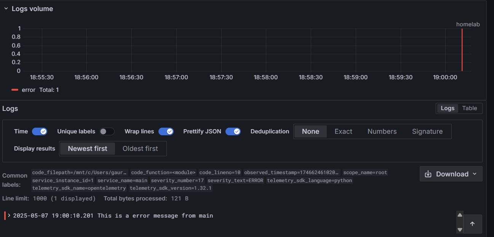

# capstone-otel-logs

This repo demonstrate use of Opentelemetry auto-instrumentation for Logs(signal) , and the vendor backed being used in Loki OSS. 

### HLD:

- Python script uses otlp library that does monkey patching(at runtime) and attach the otel logger to global logger .
- It uses otlphttp exporter to send logs directly to Loki native otlp backend : /otlp/v1/logs without using an agent inbetween.

### Results:

